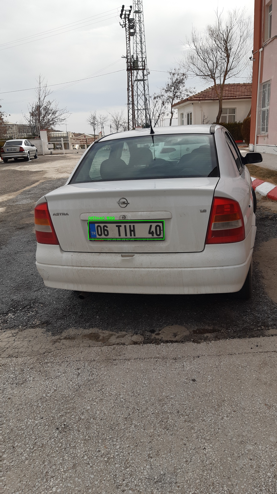
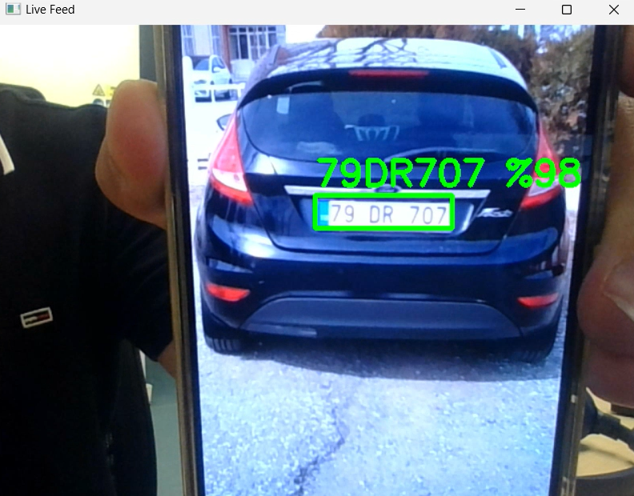
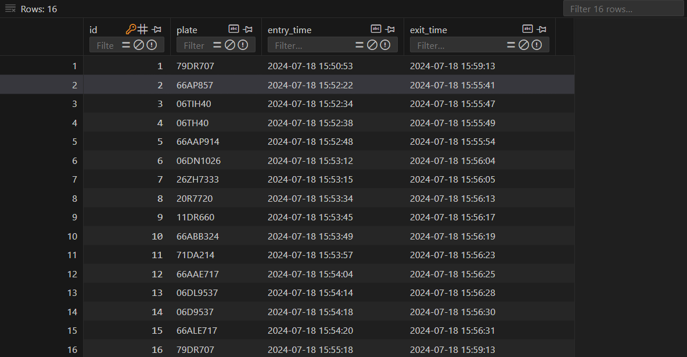

# Automatic License Plate Detection Project

## Overview

This project focuses on developing a comprehensive parking management system that utilizes deep learning and machine learning techniques to detect and read vehicle license plates. The system is capable of processing real-time video streams from parking lot cameras using RTSP or from the computer's own camera, recording entry and exit times of vehicles into a database.

The main goal of this project is to automate the process of monitoring vehicle movements in a parking lot, providing a seamless and efficient way to manage parking spaces and track vehicle activities.


## Features

- **Real-time License Plate Detection:** Uses live video feeds to detect and recognize license plates in real-time.
- **Database Logging:** Automatically logs vehicle entry and exit times into an SQL database.
- **RTSP and Local Camera Support:** Can connect to RTSP streams from IP cameras or use the local camera for live detection.
- **Accurate Recognition:** Leverages advanced machine learning models for precise recognition.
- **Scalable Solution:** Easily integrates with existing parking management systems.

## Technologies Used

- **Deep Learning:** Implements Convolutional Neural Networks (CNNs) for detecting and recognizing license plates.
- **YOLOv8:** Utilizes the YOLOv8 architecture for fast and accurate object detection.
- **OpenCV:** Handles image processing tasks, such as capturing video frames and manipulating images.
- **Python:** The main programming language for the project.
- **SQL:** Used to create and manage the database for recording vehicle entry and exit times.
- **PyTorch:** The deep learning framework for building and training models.
- **RTSP Protocol:** Enables streaming from IP cameras for real-time detection.


### Dependencies

```bash
pip install -r requirements.txt
```


### Database Setup

You'll need to set up an SQL database to store the vehicle entry and exit times. Here's a simple example using SQLite:

```sql
CREATE TABLE parking_records (
    id INTEGER PRIMARY KEY AUTOINCREMENT,
    license_plate TEXT NOT NULL,
    entry_time TIMESTAMP DEFAULT CURRENT_TIMESTAMP,
    exit_time TIMESTAMP
);
```

## System Architecture

The system consists of several components working together to achieve efficient license plate detection and management:

1. **Video Stream Input:** Captures video frames from RTSP cameras or a local webcam.
2. **License Plate Detection:** Processes frames to detect license plates using the YOLOv8 model.
3. **License Plate Recognition:** Reads the detected license plates using Optical Character Recognition (OCR).
4. **Database Logging:** Stores the entry and exit times of vehicles in an SQL database.
5. **User Interface:** Displays detected license plates and database records (optional).

### Architecture Diagram

```plaintext
[Camera/RTSP] --> [Video Stream] --> [License Plate Detection] --> [OCR] --> [Database Logging]
     |                                                                        |
     +--------------------------------[User Interface]------------------------+
```


## Database Integration

The project includes a fully integrated database solution for storing vehicle entry and exit times. The database automatically logs each detected license plate's entry time when it first enters the camera's view. If a detected plate already has an entry time but no exit time, the system logs the current time as the exit time.

### Database Schema

Here's a sample schema of the SQL database used in the project:

```sql
CREATE TABLE parking_records (
    id INTEGER PRIMARY KEY AUTOINCREMENT,
    license_plate TEXT NOT NULL,
    entry_time TIMESTAMP DEFAULT CURRENT_TIMESTAMP,
    exit_time TIMESTAMP
);
```

- `id`: Unique identifier for each record.
- `license_plate`: The recognized license plate number.
- `entry_time`: Timestamp of when the vehicle enters the parking lot.
- `exit_time`: Timestamp of when the vehicle exits the parking lot.

### Example Database View

| ID  | License Plate | Entry Time          | Exit Time          |
|-----|---------------|---------------------|--------------------|
| 1   | ABC1234       | 2024-07-24 09:15:00 | 2024-07-24 11:30:00|
| 2   | XYZ5678       | 2024-07-24 09:45:00 |                    |
| 3   | LMN8901       | 2024-07-24 10:00:00 | 2024-07-24 11:00:00|


## Example Outputs

Here are some examples of the system's outputs during operation:

### Example 1: Detected License Plate

**Input Frame:**



### Example 2: Live Camera Feed

**Real-time Detection:**



### Example 3: Database Entry

**Database Record:**


